# REINFORCE

## Overview

This repository contains a PyTorch implementation of Monte Carlo policy gradient reinforcement (REINFORCE) for discrete action spaces.  

🚧 🛠️👷‍♀️ 🛑 Under construction...

## Setup

### Required Dependencies

Install the required dependencies using the following command:

```bash
pip install -r requirements.txt
```

### Running the Algorithm

You can run the algorithm on any supported Gymnasium environment. For example:

```bash
python main.py --env 'LunarLander-v2'
```
<!-- 
Notes: Reward scaling appears to work really well for some environments (BipedalWalker) but it might be limiting the upper bound of performance on some other environments. I've increased the number of episodes to 50k for the Mujoco environments, if that gives the agent enough time to learn I'll rerun on the Gymnasium ones. Examples in the paper train for *millions* of timesteps...

<table>
    <tr>
        <td>
            <p><b>Pendulum-v1</b></p>
            
        </td>
        <td>
            <p><b>MountainCarContinuous-v0</b></p>
            
        </td>
        <td>
            <p><b>LunarLanderContinuous-v2</b></p>
            
        </td>
        <td>
            <p><b>BipedalWalker-v3</b></p>
            
        </td>
    </tr>
    <tr>
        <td>
            
        </td>
        <td>
            
        </td>
        <td>
            
        </td>
        <td>
            
        </td>
    </tr>
</table> -->
<!-- <table>
    <tr>
        <td>
            <p><b>LundarLander-v2</b></p>
            
        </td>
        <td>
            <p><b>Asteroids-v5</b></p>
            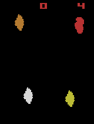
        </td>
        <td>
            <p><b>Breakout-v5</b></p>
            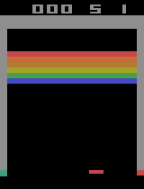
        </td>
    </tr>
    <tr>
        <td>
            
        </td>
        <td>
            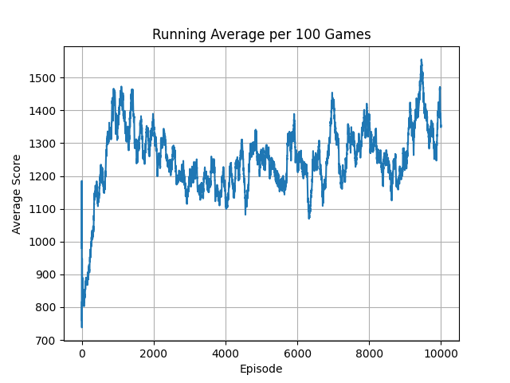
        </td>
        <td>
            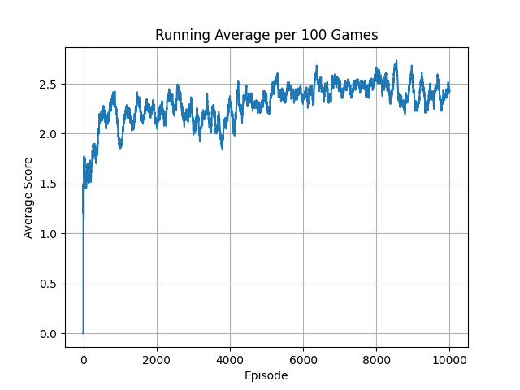
        </td>
    </tr>
</table>
<table>
    <tr>
        <td>
            <p><b>BeamRider-v5</b></p>
            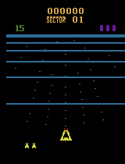
        </td>
        <td>
            <p><b>Centipede-v5</b></p>
            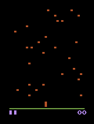
        </td>
        <td>
            <p><b>DonkeyKong-v5</b></p>
            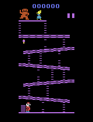
        </td>
    </tr>
    <tr>
        <td>
            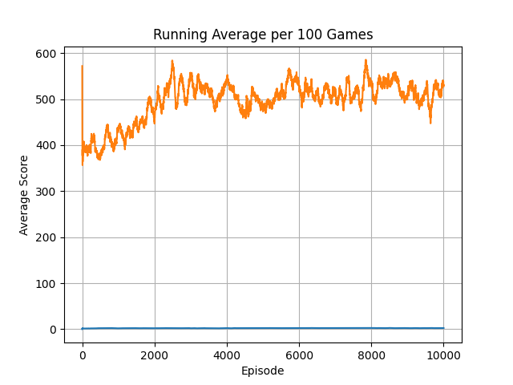
        </td>
        <td>
            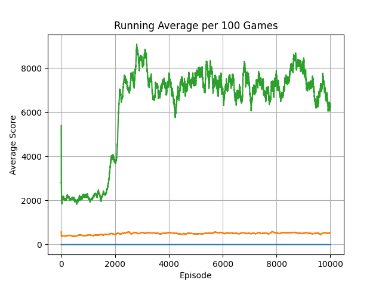
        </td>
        <td>
            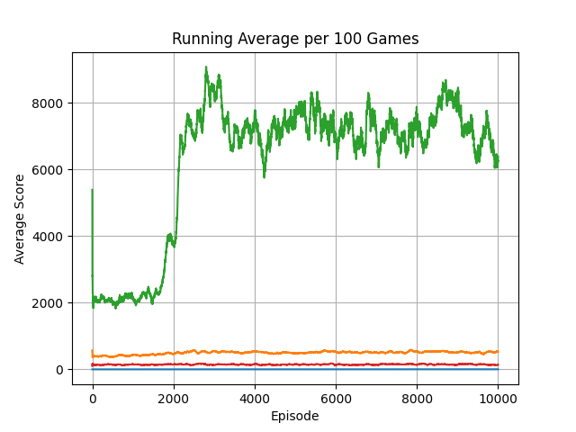
        </td>
    </tr>
</table>
<table>
    <tr>
        <td>
            <p><b>Frogger-v5</b></p>
            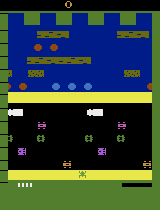
        </td>
        <td>
            <p><b>KungFuMaster-v5</b></p>
            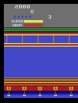
        </td>
        <td>
            <p><b>MarioBros-v5</b></p>
            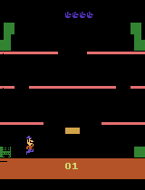
        </td>
    </tr>
    <tr>
        <td>
            
        </td>
        <td>
            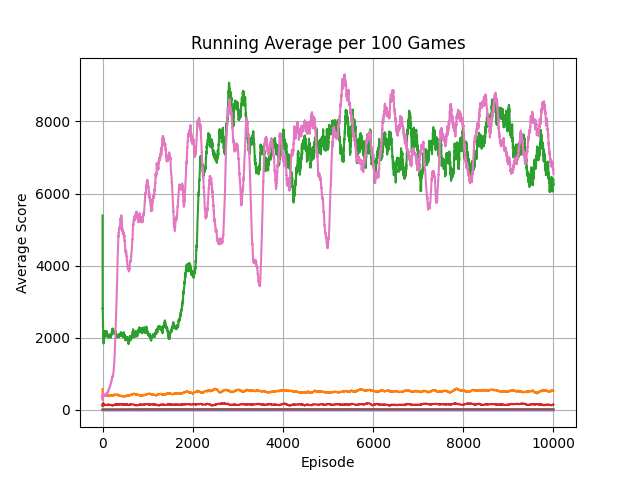
        </td>
        <td>
            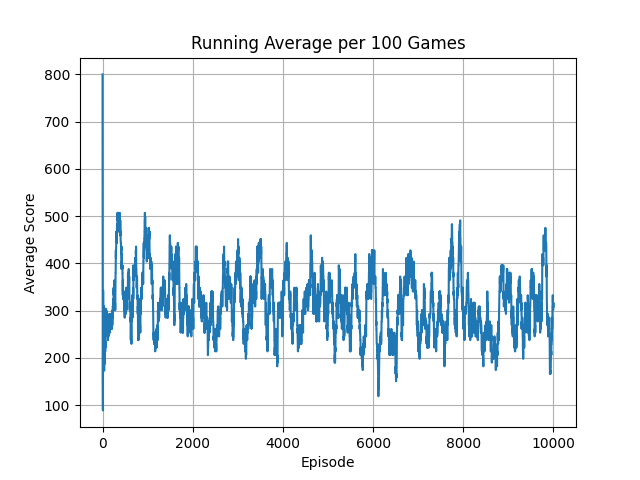
        </td>
    </tr>
</table>
<table>
    <tr>
        <td>
            <p><b>MsPacman-v5</b></p>
            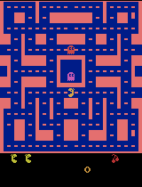
        </td>
        <td>
            <p><b>SpaceInvaders-v5</b></p>
            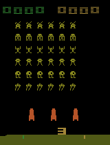
        </td>
        <td>
            <p><b>Tetris-v5</b></p>
            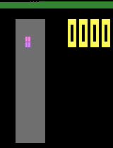
        </td>
    </tr>
    <tr>
        <td>
            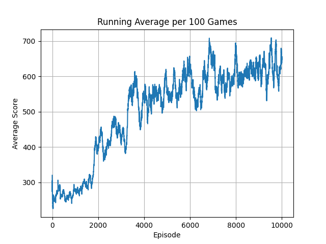
        </td>
        <td>
            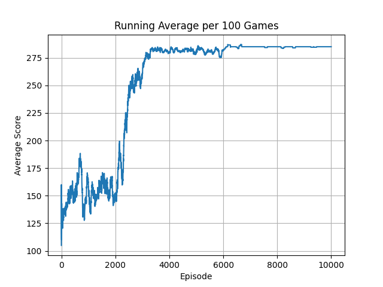
        </td>
        <td>
            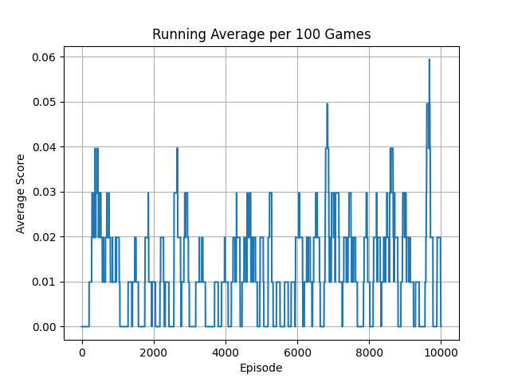
        </td>
    </tr>
</table> -->

## Acknowledgements

Special thanks to Phil Tabor, an excellent teacher! I highly recommend his [Youtube channel](https://www.youtube.com/machinelearningwithphil).
